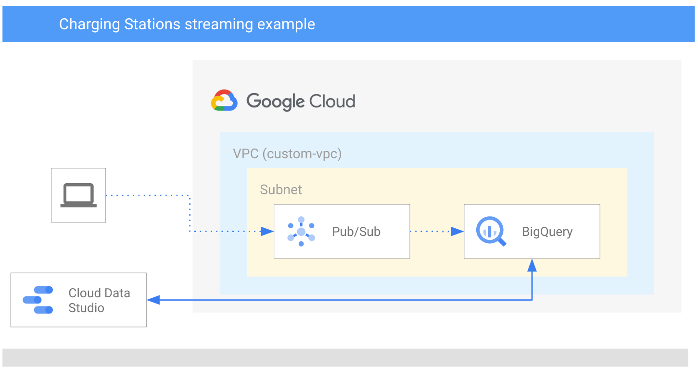
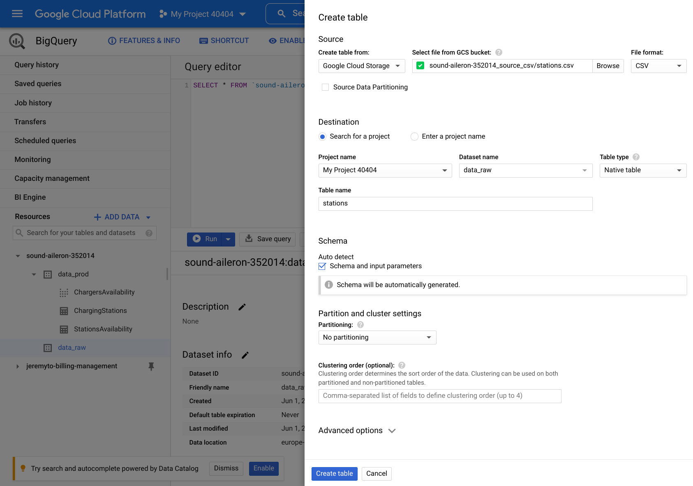
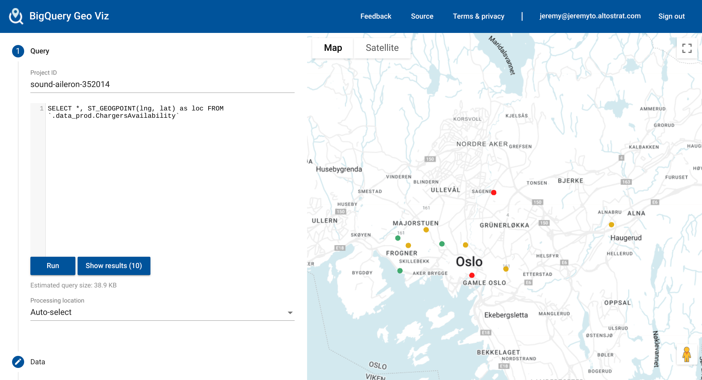

# gcp-streaming-chargingstations
Simple ELT example using Pub/Sub, DataFlow, BigQuery and GeoViz. The example uses car charging stations data, which is complemented with fictive charger status.


## Overall architecture




## Project structure
```
.
├── bigquery.tf (datasets and tables)
├── config.tf (services and provider)
├── iam.tf (service accounts and roles)
├── imgs
│   ├── 0.png
│   ├── 1.png
│   └── 2.png
├── network.tf (vpc and subnet)
├── README.md (this file)
├── stations.csv (sample data)
├── storage.tf (blob storage for sample file)
├── streaming.tf (pub/sub and dataflow)
├── terraform.tfvars.json (environment variables - not commited)
├── update_stations.py (station status generator)
└── vars.tf (variables configuration)
```

## Setup

1. Find out your GCP project's id and number from the dashboard in the cloud console, and run the following commands in a terminal at the root of source code (replace `your_project_number` and `your_project_id` by the correct values):
```shell
sed -i 's/PROJECT_NMR/your_project_number/g' *.*
sed -i 's/PROJECT_ID/your_project_id/g' *.*
```

## Install

1. Run the following command at the root of the folder:
```shell 
$ ./install.sh
$ terraform init
$ terraform plan
$ terraform apply
```

> This will install 24 resources

2. Create a table `stations` in the `data_raw` dataset. Use the `stations.csv` file from the bucket `YOUR-PROJECT-ID_source_csv`

> Source: https://opencom.no/dataset/ladetasjoner-oslo




3. Insert and parse the raw data in the production dataset

```
INSERT INTO `.data_prod.ChargingStations` SELECT id, name, street, town as city, lat, lng, provider FROM `.data_raw.stations`
```

4. Generate fictive charging station status using the python generator, by running the following in a terminal at the root of your project:

```shell
$ python3 update_stations.py

```

> This will output the Pub/Sub message id as a result


5. Visualize the results. Open BigQuery Geo Viz with the following link. Select the project where you have the data, and use the following SQL Query to render the location of the 

https://bigquerygeoviz.appspot.com/

```
SELECT *, ST_GEOGPOINT(lng, lat) as loc FROM `.data_prod.ChargersAvailability` 
```




## Uninstall


1. Manually delete the BigQuery table `stations` in the dataset `data_raw`

2. Run the following at the root of your project

```shell 
$ terraform destroy
```

> All resources will now be removed from your project